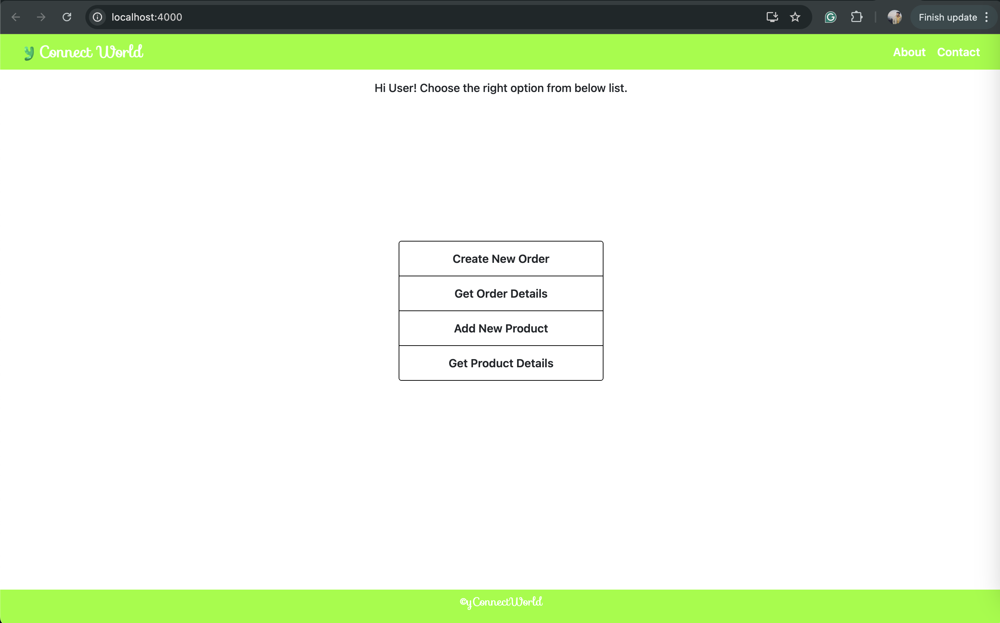

# Store Frontend

#### _Setting up Store Frontend using AWS EC2._
1. Toss up a new server for Store Frontend and allow inbound traffic at port 4000 as our application will run at this port and allow the outbound traffic for all.
2. Update the apt and apt-get package manager of our EC2 machine and then Install the docker and docker-compose with below commands.
```sudo apt update && sudo apt-get update```
```sudo apt install docker.io -Y && sudo apt install docker-compose -Y```
3. Fetch the [Store Frontend](https://hub.docker.com/repository/docker/yashbbhatt/store-frontend-linux/general) and run using the docker using below command.
```sudo docker run -d -p 4000:4000 -e PORT=4000 -e REACT_APP_MIDDLEWARE_API=http://54.227.145.122:3002/ yashbbhatt/store-frontend-linux```
4. Check the 4000 port you will see You Frontend Homepage as attached below.


#### _Setting up [Store Middleware](https://github.com/yashbhatt1304/StoreMiddleware/blob/main/README.md) using AWS EC2._
1. After seeting Store Frontend we'll setup the [Store Middleware](https://github.com/yashbhatt1304/StoreMiddleware/blob/main/README.md).